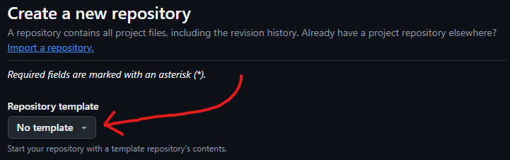
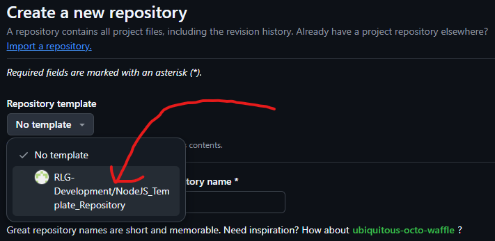
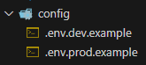

# NodeJS Template Repository

<p style="font-size: 25px; color: red;" align="center"><b>REPLACE WITH YOUR APPLICATION DESCRIPTION</b></p>

This is a template repository for any NodeJS applications that need to be built for R+L Global Logistics. It contains an already complete file structure such that any new files added should already have a folder where that file should be located. This template contains a multitude of useful functions/files that can be easily applied to NodeJS applications to shorten development time and decrease difficulty. A more in-depth explanation of the functionality that is included within this template, you can check [here](#features).

# Table of Contents

- [Installation](#installation)
  - [Installation Example](#installation-example)
- [Configuration](#configuration)
  - [Environment Configuration](#environment-configuration)
    - [Package.json Scripts](#packagejson-scripts)
    - [NPM Script Example](#npm-script-example)
  - [NodeJS Package Configuration](#nodejs-package-configuration)
    - [NodeJS Package Configuration Example](#nodejs-package-configuration-example)
- [Features](#features)
  - [Custom Environment](#custom-environment)
    - [Package.json Scripts](#packagejson-scripts)
    - ["app.js" Source Code](#appjs-source-code)
    - ["/config/" Files](#config-files)
  - [Custom Log Utility](#custom-log-utility)
    - [Syslog Log Levels](#syslog-log-levels)
    - [Log Utility Installation](#log-utility-installation)
    - [Log Utility Use](#log-utility-use)
  - [Axios Utility](#axios-utility)
    - [Axios Utility Installation](#axios-utility-installation)
    - [Axios Utility Use](#axios-utility-use)
  - [Pipedrive Utility](#pipedrive-utility)
    - [Pipedrive Utility Installation](#pipedrive-utility-installation)
    - [Pipedrive Utility Use](#pipedrive-utility-use)
  - [Webex Utility](#webex-utility)
    - [Webex Utility Installation](#webex-utility-installation)
    - [Webex Utility Use](#webex-utility-use)
  - [Running the Template](#running-the-template)
    - [NPM Example Script](#npm-example-script)
    - [App.js Code](#appjs-code)
- [Maintainers](#maintainers)
- [Trouble Shooting](#trouble-shooting)

# Installation

<p style="font-size: 25px; color: red;" align="center"><b>REPLACE WITH YOUR INSTALLATION INSTRUCTIONS</b></p>

To use this template when creating a new repository in GitHub, you **MUST** create your repository using the GUI on GitHub's website. Then, there is an option with the name "Repository template" that has a dropdown. Inside of that dropdown, you can select the option that matches the name of this repository - "RLG-Development/NodeJS_Template_Repository".

### Installation Example





# Configuration

<p style="font-size: 25px; color: red;" align="center"><b>REPLACE WITH YOUR CONFIGURATION INSTRUCTIONS</b></p>

## Environment Configuration

Inside of the root directory for this template is a folder with the name "config". This folder contains two **EXAMPLE** environment variable files. Do not worry that these files have been scraped by GitHub, they only contain dummy values with no real use for anything other than as an example. In addition to this, any other files with the prefix ".env." have been listed in the ".gitignore" file. Both of these environment variable files are meant to highlight a feature of this template, the built in [custom environments](#custom-environment). Inside of the file "package.json", there are configuration settings for different scripts that can be invoked with a simple "npm" command. These scripts allow for you to quickly swap between different environments with different command line arguments used during compilation and deployment. You must edit "package.json" if you would like to load different files or provide different command line arguments.

### Package.json Scripts

```json
{
	"scripts": {
		"start": "node app.js prod",
		"test": "node app.js dev",
		"dev": "nodemon app.js dev",
		"example": "node app.js example.dev"
	}
}
```

### NPM Script Example

```bash
$npm run example
```

## NodeJS Package Configuration

To make sure that all of the NodeJS packages that were leveraged in creating this template are installed, you must run the install function that comes pre-packaged with NodeJS. You must also have NodeJS installed on your machine.

### NodeJS Package Configuration Example

```bash
$npm install
```

# Features

<p style="font-size: 25px; color: red;" align="center"><b>REPLACE WITH YOUR FEATURES</b></p>

## Custom Environment

This NodeJS template already has two custom environment variable files that are set up so that a developer can easily swap between environment settings with little to no difficulty. These files are located at the path "/config/". Each of these files contain environment variables that have the same name, but different values. This is due to the fact that many variables change when switching development/production environments. In order to make testing in any environment much easier, the functionality of different environment variable files has been added. In conjunction with these files, some example scripts have been added to "package.json" that can be used to start the NodeJS server with custom command line arguments. These connect into the logic that is at the top of the main server file "app.js" that loads one of the environment variable files based on the custom command line argument. Essentially, code in "app.js" is configured such that the command line argument is used as the name for the environment variable file that is loaded through "argv".

### Package.json Scripts

```json
{
	"scripts": {
		"start": "node app.js prod",
		"test": "node app.js dev",
		"dev": "nodemon app.js dev",
		"example": "node app.js example.dev"
	}
}
```

### "app.js" Source Code

```js
require("dotenv").config({
	path: path.join(__dirname, `config/.env.${process.argv[2]}`),
});
```

### "/config/" Files



## Custom Log Utility

Logs are an incredibly important part of any software, and this template includes some JavaScript code that creates a custom logger that can be used to log descriptive and eye-catching logs. This code is located in "/src/utils/winston_helper.js" and has been included in the other built-in code already. The custom logger uses the syslog log levels instead of the npm log levels to help with scanning through a long log document. The logger has also been customized to **ERASE** the logfile after 14 days of use, though this can be changed if desired by the developer.

### Syslog Log Levels

| Level |   Severity    | Keyword |           Usage            |
| :---: | :-----------: | :-----: | :------------------------: |
|   0   |   Emergency   |  emerg  |  logger.emerg("MESSAGE");  |
|   1   |     Alert     |  alert  |  logger.alert("MESSAGE");  |
|   2   |   Critical    |  crit   |   logger.crit("MESSAGE")   |
|   3   |     Error     |   err   |   logger.err("MESSAGE");   |
|   4   |    Warning    | warning | logger.warning("MESSAGE"); |
|   5   |    Notice     | notice  | logger.notice("MESSAGE");  |
|   6   | Informational |  info   |  logger.info("MESSAGE");   |
|   7   |     Debug     |  debug  |  logger.debug("MESSAGE");  |

The logger has been further customized by adding an environment variable named "LOG_LEVEL", which is used in the source code of the logger to determine what the highest level of log to record is. If this environment variable has not been set, the default is "Informational". The example production file sets the log level as "warning" while the example development file sets the log level as "debug".

### Log Utility Installation

```js
const { logger } = require(path.join(__dirname), "/src/utils/winston_helper.js");
```

### Log Utility Use

```js
try {
  output = await some code that does something;
  logger.info(output);
} catch (error) {
  logger.error(error.message);
}
```

## Axios Utility

One of the most commonly used functions in our NodeJS applications is our use of HTTP requests, specifically when we make them with the assistance of the "axios" npm package. This template comes pre-loaded with a file that contains some utility functions for the easy usage of "axios" without having to import and setup the package every time a developer wants to use it. Instead, the utility file "/src/utils/axios_helper.js" contains two export functions that expedite the use of "GET" and "POST" HTTP requests.

### Axios Utility Installation

```js
const requester = require(path.join(__dirname, "/src/utils/axios_helper"));
```

### Axios Utility Use

```js
response = await requester.get_request("http://127.0.0.1/example", { accept: "application/json" });

response = await requester.post_request(
	"http://127.0.0.1/example",
	{ data: "example data" },
	{ accept: "application/json" }
);
```

## Pipedrive Utility

When creating an application that uses a Pipedrive Modal, Panel, or Floating Window, the HTML code for this element must include and initialization of the Pipedrive SDK. For developer ease of use, the setup and configuration for this SDK has already been included in this template at "/src/utils/pipedrive_helper".

### Pipedrive Utility Installation

```js
const { initialize_sdk } = require(path.join(__dirname, "src/utils/pipedrive_helper"));
```

### Pipedrive Utility Use

```js
const sdk = initialize_sdk();
```

## Webex Utility

To send a quick message in Webex from a bot to a specified room, you can use the function "send_webex" in the file "/src/utils/general_helper.js".

### Webex Utility Installation

```js
const utils = require(path.join(__dirname, "src/utils/pipedrive_helper"));
```

### Webex Utility Use

```js
utils.send_webex("TEST MESSAGE");
```

## Running the Template

This template is already configured so that it can be run and tested out of the box. There is some code that is already included in "/app.js" that is meant to show off the previously explained features in action. This code has been included inside of when the server begins listening on the designated port. To run this code, you must use the included "example" npm script that is located in "/package.json".

### NPM Example Script

```bash
$npm run example
```

### App.js Code

```js
const server = app.listen(port, async () => {
	console.log(`Success! Server is listening at ${process.env.HOST}:${port}`);

	console.log(
		"To test the custom endpoint setup, simply navigate in a browser to the site listed above plus '/example' or ping with Postman!"
	);

	logger.info("Testing Winston!");
	console.log(
		"To see the Winston logging package in effect, go to ./src/logs/ to see the new log generated by this code: logger.info('Testing Winston!')"
	);
	await requester.get_request("http://127.0.0:8080/example", {
		accept: "application/json",
	});
	console.log(
		"To see how an error is logged with Winston, check the same log file specified above for the output from a failed get request using the code from ./src/utils/axios_helper.js"
	);

	test_response = await requester.get_request("http://127.0.0.1:8080/example", {
		accept: "application/json",
	});
	console.log(test_response.data);
});
```

# Maintainers

<p style="font-size: 25px; color: red;" align="center"><b>REPLACE WITH YOUR MAINTAINERS</b></p>

|     Name      |    Organizational Email    | Date of Access |
| :-----------: | :------------------------: | :------------: |
| Elijah Sprung | elijah.sprung@rlglobal.com |   01/01/2024   |

# Trouble Shooting

<p style="font-size: 25px; color: red;" align="center"><b>REPLACE WITH YOUR FAQ/TROUBLESHOOTING STEPS</b></p>
